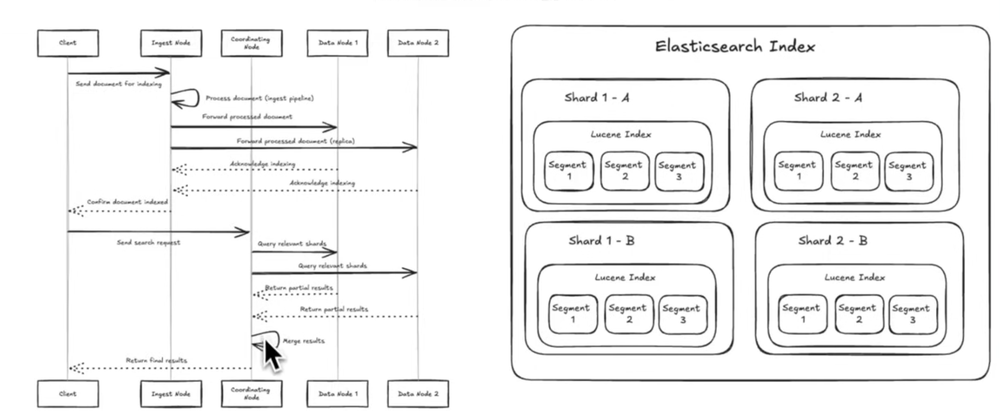

# Elasticsearch Overview

Elasticsearch is a **distributed, RESTful search and analytics engine** built on top of **Apache Lucene**.
 It is designed to be **fast, scalable, and easy to use**, and is one of the most popular **search-optimized databases** in production today.

Elasticsearch is widely used by companies such as **Netflix, Uber, Yelp**, and many others for search, analytics, and observability use cases.

------

## Getting Started: Running Elasticsearch Locally

You can quickly spin up a single-node Elasticsearch instance using Docker:

```
docker --version

docker run -d \
  --name elasticsearch \
  -p 9200:9200 \
  -p 9300:9300 \
  -e "discovery.type=single-node" \
  -e "xpack.security.enabled=false" \
  docker.elastic.co/elasticsearch/elasticsearch:8.11.3
```

This setup is ideal for **local development and learning**, with security disabled and a single-node cluster configuration.

------

## Core Concepts and Query Flow

The sections below provide a **concise, structured explanation of core Elasticsearch concepts**, organized around how a **user query** flows through the system and how data is modeled, searched, and returned.

------

## 1. User Query (Search Request)

A **user query** is the input that initiates a search.
 In Elasticsearch, queries are expressed using the **Query DSL (Domain-Specific Language)** in JSON format.

### Key Ideas

- Queries describe **what to search for**
- Filters describe **constraints** (often cached and do not affect scoring)
- Queries can be combined, nested, boosted, or weighted

### Common Query Types

- **Full-text search**: `match`, `multi_match`
- **Exact match**: `term`, `terms`
- **Range queries**: `range`
- **Boolean logic**: `bool` (`must`, `should`, `filter`, `must_not`)

------

## 2. Sorting

**Sorting** controls the **order of search results**.

### Common Sorting Criteria

- Relevance score (`_score`) — default for full-text queries
- Numeric or date fields (e.g., price, timestamp)
- Keyword fields (lexicographic order)
- Script-based sorting (advanced use cases)

### Examples

- Sort by relevance first, then by recency
- Sort products by price (ascending or descending)

------

## 3. Facets (Aggregations)

In modern Elasticsearch, **facets are implemented as Aggregations**.

### Purpose

- Summarize search results
- Enable filtering and exploration (common in analytics and e-commerce)

### Common Aggregation Types

- **Terms aggregation** — categories, tags, brands
- **Range / Histogram** — price ranges, time buckets
- **Metrics** — count, average, min, max
- **Nested aggregations** — hierarchical summaries

### Examples

- Count of documents per category
- Average price per brand

------

## 4. Results (Lists of Results)

Search results are returned as a **ranked list of documents**.

### Typical Result Fields

- `_id` — document identifier
- `_score` — relevance score (if scoring applies)
- `_source` — original JSON document
- Highlighted fields (optional)
- Match explanations (optional)

### Pagination Options

- `from` + `size` — basic pagination
- `search_after` — deep pagination
- `scroll` — large batch processing

------

## 5. Documents

A **document** is the basic unit of data in Elasticsearch.

### Characteristics

- Stored as a **JSON blob**
- Represents one logical record (e.g., product, article, log)
- Schema-less at write time but governed by mappings

### Example Document

```
{
  "title": "Elasticsearch Basics",
  "author": "Emily",
  "published_date": "2024-01-01",
  "tags": ["search", "elasticsearch"],
  "views": 1024
}
```

------

## Cluster Architecture

Elasticsearch is a **distributed system** composed of multiple **nodes** working together as a cluster.
 Each node plays one or more specialized roles.

------

## Node Types

When you start an Elasticsearch cluster, you are actually starting multiple nodes.
 Nodes can be configured with different responsibilities.

### Master Node

- Coordinates the cluster
- Performs cluster-level operations:
  - Creating or deleting indices
  - Adding or removing nodes
- Only **one active master** exists at any time

### Coordinating Node

- Acts as the **query router**
- Receives search requests from clients
- Distributes queries to data nodes
- Gathers and merges results
- Often considered the **frontend** of the cluster

Coordinateion node requires handling networks traffic with the outside world.

- When a cluster starts, a set of **master-eligible nodes** participate in a leader election
- One node becomes the active master
- Other master-eligible nodes remain on standby
- This ensures **high availability and fault tolerance**

### Data Node

- Stores indexed data
- Executes search and aggregation queries, heavily i/o (read/write) requests
- The primary workhorse of Elasticsearch
- Large clusters typically have many data nodes

Data nodes can be specialized based on data lifecycle and access patterns:

- **Hot** — frequently queried, recently written data
- **Warm** — less frequently accessed
- **Cold** — rarely queried, mostly read-only
- **Frozen** — archival data, queried infrequently

This tiered approach enables **cost-efficient storage and querying**. Need lots of disk IO or need lots of memory.

### Ingest Node

- Handles **data ingestion and transformation**
- Executes ingest pipelines (e.g., parsing, enrichment, normalization)
- Useful for ETL-style preprocessing before indexing
- Typically are more CPU bounded.

### Machine Learning Node

- Runs Elasticsearch’s built-in ML features
- Used for anomaly detection and advanced analytics
- Might need to access GPU

------

## Node Configuration and Deployment

- A single Elasticsearch instance can serve **multiple roles**
- For example, a node can be both **master-eligible** and a **coordinating node**
- In production, roles are often **separated**:
  - Ingest nodes → CPU-heavy
  - Data nodes → high disk I/O and memory
  - Master nodes → stability and coordination

When choose different servers or VM types to take on node responsibility.

## Where Search Happens

While ingest and coordinating nodes are important, **data nodes** are where search execution occurs:

- Queries are executed against shards on data nodes
- Results are scored and aggregated
- Final results are merged and returned to the client

Understanding **data nodes** is key to understanding Elasticsearch performance and scalability.

The primary function of data nodes is to store documents and make them rapidly searchable. Elasticsearch does this by separating the raw _source data (remember seeing this in our search results above?) from Lucene indexes that are used in search. You can think of it like having a separate document database.

Requests proceed in two phases: first the "query" phase is when the relevant documents are identified using the optimized index data structures and the "fetch" phase is when those document IDs are (optionally) pulled from the nodes.

Data nodes house our indices (from earlier) which are comprised of shards and their replicas. Inside those shards are Lucene indexes which are made up of Lucene segments.

Shards allows Elasticsearch to split data (and the accompanying indexes) across hosts. This allows Elasticsearch to distribute both your documents and the corresponding index structures across multiple nodes in your cluster, which significantly improve performance and scalability.

Searches will be executed across all relevant shards in parallel, and the results will be merged and sorted by the coordinating node. Queries are generally executed on the coordinating node, which then distributes the query to the appropriate shards.

A replica is an exact copy of a shard. Elasticsearch allows you to create one or more copies of your index's shards, which are called replica shards, or just replicas.

Replicas serve two primary purposes: high availability and increased throughput. If our shard can handle X TPS, then by having Y replicas we can handle X * Y TPS (all other things equal).

The coordinating node can leverage replicas to improve search performance by distributing search requests across all available shard copies (primary and replica), effectively load balancing the search workload across the cluster.

Lastly, Elasticsearch shards are 1:1 with Lucene indexes. Remember earlier that Lucene is the low-level, highly optimized search library at the heart of Elasticsearch. Many of the operations that Elasticsearch needs to perform with shards (merging, splitting, refreshing, searching) are actually proxy operations on the Lucene indexes underneath.

### Lucene Segment CRUD

Lucene indexes are made up of segments, the base unit of our search engine. Segments are immutable containers of indexed data. Let that word sink in for one second before we continue. Don't we need to be able to update, add, and delete documents from our Elasticsearch index?

The way that Lucene indexes work is by batching writes and constructing segments. When we insert a document, we don't immediately store it in the index. Instead, we add it to a segment. When we have a batch of documents, we construct a segment and flush it out to disk.
When segments get too numerous, we can merge them: we create a new segment from the segments we want to merge and remove the previous segments.

Deletions are tricky: each segment actually has a set of deleted identifiers. When a segment is queried for data against a deleted document, it pretends it doesn't exist - but the data is still there! During merge operations, the merged segments clean up deleted documents.

Finally for update events we don't actually update the segment. Instead, we soft delete the old document and insert a new document with the updated data. That old document gets cleaned up on segment merge events later. This makes deletions super fast but have some lasting performance penalties until we merge and clean up those segments. Ideally we're not doing it a lot!

This immutable architecture carries a number of benefits for Lucene:

- Improved write performance: New documents can be quickly added to new segments without modifying existing ones.

- Efficient caching: Since segments are immutable, they can be safely cached in memory or on SSD without worrying about consistency issues.

- Simplified concurrency: Read operations don't need to worry about the data changing mid-query, simplifying concurrent access.

- Easier recovery: In case of a crash, it's easier to recover from immutable segments as their state is known and consistent.

- Optimized compression: Immutable data can be more effectively compressed, saving disk space.

- Faster searches: The immutable nature allows for optimized data structures and algorithms for searching.

However, this design also introduces some challenges, such as the need for periodic segment merges and the temporary increased storage requirements before cleanup operations. Elasticsearch and Lucene have sophisticated mechanisms to manage these trade-offs effectively.


## Lucene Segment Internals

Lucene segments are not just passive containers for documents. Each segment stores a set of **highly optimized data structures** that make fast search and analytics possible. Two of the most important of these structures are the **inverted index** and **doc values**.

------

## Inverted Index

If Elasticsearch is built on Lucene, then the **inverted index** is the core mechanism that makes Lucene fast.

At a high level, there are two fundamental ways to make data retrieval efficient:

1. **Organize data by how it will be queried**
   - Scanning a list: `O(n)`
   - Searching a sorted list: `O(log n)`
   - Hash-based lookup: `O(1)`
2. **Create additional data structures (copies of the data)** that are optimized for specific access patterns

Lucene relies heavily on the second approach.

------

### Why Inverted Indexes Exist

Imagine you have **1 billion books**, and only a small subset contain the word **"lazy"** in their title.
 Your goal is to find those books as quickly as possible.

Without an index, you would need to:

- Scan every document
- Check whether the title contains `"lazy"`
- Pay an `O(n)` cost

This approach does not scale.

------

### How the Inverted Index Works

An **inverted index** maps **terms** (words, numbers, tokens) to the **documents that contain them**.

Conceptually, it looks like this:

```
"lazy" → [doc_12, doc_53, doc_1042, ...]
"quick" → [doc_3, doc_19, doc_88, ...]
```

Instead of scanning every document:

- Elasticsearch looks up the term `"lazy"`
- Instantly retrieves the list of matching document IDs

This turns an expensive full scan into a near-constant-time lookup.

By **duplicating and reorganizing data**, Lucene transforms:

- `O(n)` document scans
   into
- Fast, index-based retrieval

This is the foundation of keyword search performance in Elasticsearch.

------

## Doc Values

The inverted index answers the question:

> *Which documents match my query?*

But it does **not** answer:

> *How should those documents be sorted or aggregated?*

That’s where **doc values** come in.

------

### The Sorting and Aggregation Problem

Suppose your query matches thousands of documents, and you want to:

- Sort them by **price**
- Compute averages
- Perform aggregations

If each document were stored row-by-row (like in a traditional relational database), Elasticsearch would need to:

- Load the entire document
- Extract the `price` field
- Repeat this for every result

This is inefficient when you only need **one field**.

------

### Columnar Storage with Doc Values

Doc values solve this problem using a **columnar storage format**.

For each field, doc values store:

- A **contiguous, column-oriented representation**
- One value per document, per segment

This is similar to how analytics systems like **Apache Spark** or **Amazon Redshift** achieve high performance.

With doc values:

- Sorting reads only the required column
- Aggregations operate on compact, contiguous memory
- Cache efficiency and I/O performance are dramatically improved

In short:

- **Inverted index** → finds *which* documents match
- **Doc values** → provide the data needed to *sort and aggregate* those documents efficiently

------

## Coordinating Nodes

Elasticsearch is a **distributed system**, and coordinating nodes act as the **entry point** for user requests.

Their responsibilities include:

- Receiving search requests from clients
- Parsing and validating queries
- Determining which nodes hold the relevant data
- Orchestrating execution across the cluster
- Merging and returning results to the user

------

## Query Planning

One of the most critical responsibilities of a coordinating node is **query planning**.

After a query is parsed, the query planner determines:

- Which indexes and shards to query
- Which data structures to use (e.g., inverted index vs. doc values)
- The most efficient order to execute query components
- How to combine partial results from multiple nodes

The goal is simple:

> **Minimize latency while returning correct results**

------

## Order Optimization

To understand query planning, consider a simple example.

You search for the phrase **"bill nye"** across millions of documents.

In the inverted index:

- `"bill"` appears in **millions** of documents
- `"nye"` appears in only **hundreds**

There are many possible execution strategies:

- Start with `"nye"` and filter `"bill"`
- Start with `"bill"` and filter `"nye"`
- Load documents containing `"nye"` and do phrase matching
- Load documents containing `"bill"` and do phrase matching
- Combine posting lists in different orders

Each approach can differ in performance by **orders of magnitude**.

------

### How Elasticsearch Chooses the Best Plan

Elasticsearch collects statistics such as:

- Term frequency
- Field types
- Document lengths
- Index and shard characteristics

Using this information, the query planner:

- Executes the **most selective operations first**
- Reduces intermediate result sizes
- Minimizes CPU, memory, and I/O usage

This optimization is essential for maintaining fast query performance as:

- Data volume grows
- Query complexity increases
- Clusters scale horizontally

Using Elasticsearch

- It's usually not a good idea to use Elasticsearch as your database. It's a search engine first and foremost, and while it's incredibly powerful it's not meant to replace a traditional database. Earlier versions of Elasticsearch had a lot of issues with consistency and durability, and many of the issues that plagued CouchDB are issues that have plagued Elasticsearch. All to say: if you need the data to persist, put it somewhere else.

- Elasticsearch is designed for read-heavy workloads. If you're dealing with a write-heavy system, you might want to consider other options or implement a write buffer. While it might be convenient that you can add field for e.g. the number of likes on a post or impression counts, there's a lot of reasons this will cause ElasticSearch to struggle.

- Ensure you account for the eventual consistency model of Elasticsearch. Your results will be stale, sometimes significantly. If your use-case can't tolerate this, you may need to consider alternatives.
Elasticsearch is not a relational database. You'll want to denormalize your data as much as possible to make search queries efficient. This may require some additional transformation logic on the write side to make it happen. You should aim for your results to be provided by 1 or 2 queries.

- Not all search problems require it! If your data is small (< 100k documents) or doesn't change often, there are many other and faster solutions. See if a simple query against your primary data store is sufficient and only consider Elasticsearch if you find that to be insufficient.

- You need to be careful you're keeping Elasticsearch in sync with the underlying data. Failures in synchronization can lead to drift and are a common source of bugs with Elasticsearch.

